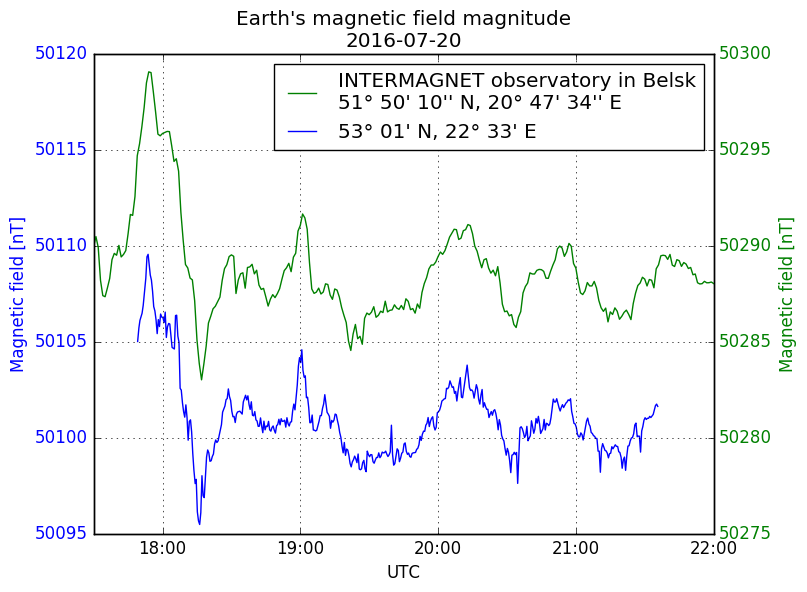
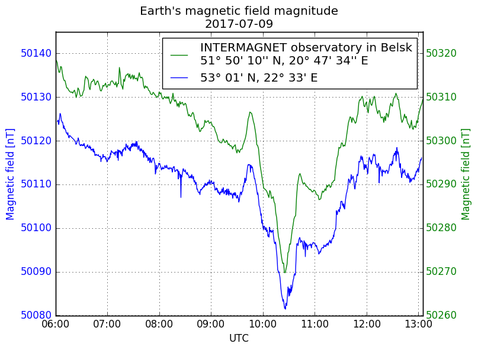
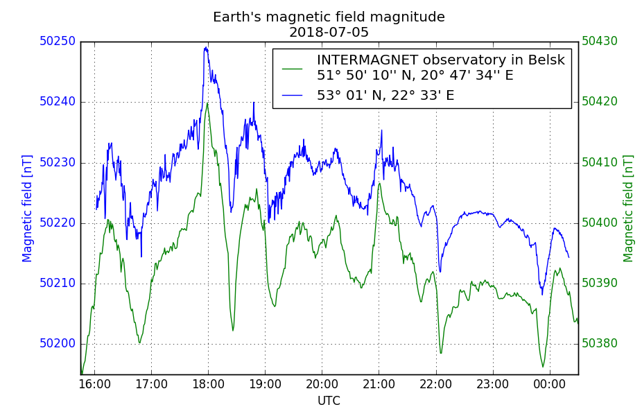
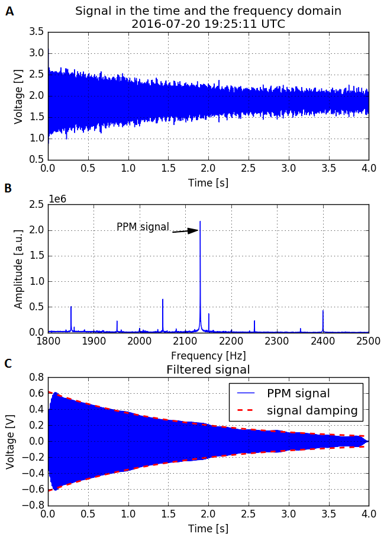
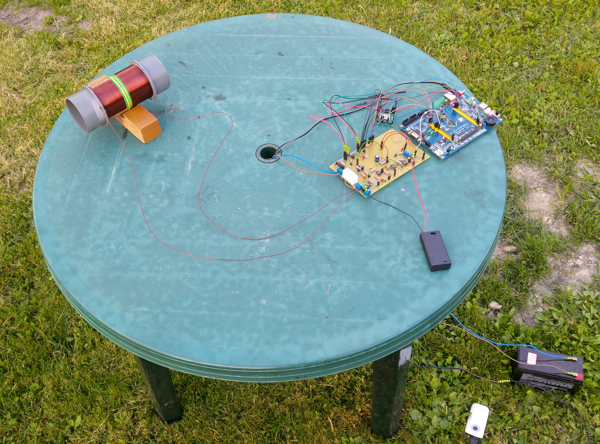

# Proton Precession Magnetometer
Proton precession magnetometer (PPM) is a device for measuring the strength of the [Earth's magnetic field], also referred to as the geomagnetic field. Its strength at the Earth's surface ranges from 30 μT to 60 μT. The geomagnetic field also changes with time. Relatively large and rapid variations occur during magnetic storms.

   [Earth's magnetic field]: http://hyperphysics.phy-astr.gsu.edu/hbase/magnetic/MagEarth.html

### Physics
Magnetic moment placed in a magnetic field experiences a torque aligning it with the field. In the proton case magnetic moment is associated with its intrinsic angular momentum - the nuclear spin. Such association between magnetic moment and angular momentum, instead of aligning with the field, causes precession about the magnetic field direction. This phenomenon is referred to as [Larmor precession]. It turns out that frequency of Larmor precession is directly proportional to the strength of the external magnetic field. For Earth's magnetic field, the proton precession signal is in the audio range (about 2 kHz). Thus, by measuring the frequency of precession, the strength of the Earth's magnetic field can be calculated.

   [Larmor precession]: http://hyperphysics.phy-astr.gsu.edu/hbase/Nuclear/larmor.html

### Hardware
Precessing proton produces an oscillating magnetic field. Observing precession of a single proton would be challenging. The way to measure the frequency of the precession is to record an oscillating magnetic field generated by large enough amount of protons precessing in sync. That’s why the heart of every PPM is a container with proton-rich fluid placed inside a copper coil. The frequency of precession is determined by measuring induced AC voltage in the coil. At room temperature all protons are lined up in random directions, thus induced AC voltage equals to zero. The coil is used to line up protons in the same direction by turning on a polarising magnetic field inside the coil by passing large current through it. After the polarisation stage, the same coil acts as a sensor. AC voltage induced in the coil is just a few microvolts at best. It is too small to be effectively measured, thus hardware amplification is essential. The first stage is preamplifier which transforms the PPM signal from microvolt range into millivolt range. The next stage of the signal processing is bandpass filtering, which helps to reduce unwanted noise. The passband of the filter should be adjusted to include precession frequency corresponding to a value of the geomagnetic field at the location of the sensor. After filtering stage, the signal is amplified and digitised by a programmed microcontroller unit (MCU) equipped with an analogue to digital converter (ADC). Then voltage samples are sent through a serial port to a Raspberry Pi Zero computer for further processing. The measurement setup is battery-powered, which greatly reduces noise in the setup.
### Data analysis
Single PPM measurement is triggered by a start command sent through a serial port from the computer. Once the start command is received by the MCU, it starts single PPM measurement. The measurement process begins with polarisation stage, then is followed by data acquisition using ADC. At the end, raw voltage samples are sent to the computer for further processing. The first step of data processing is calculating discrete Fourier transform (DFT) to find peaks in the frequency domain. Usually, there are many 50 Hz harmonics in the spectrum. It may be problematic when PPM peak lies very close to one of 50 Hz harmonics. Luckily PPM peak in my measurements lies between two 50 Hz harmonic peaks and is relatively high. PPM frequency peak can be transformed into the strength of Earth's magnetic field. However, resolution of the frequency domain calculated with DFT is limited by a length of data acquisition. The longer acquisition takes, the better resolution in the frequency domain. The amplitude of induced PPM signal decays exponentially. In this project, PPM signal is sampled for 4 seconds, which corresponds to 0,25 Hz resolution in the frequency domain, which is only about 6 nT when converted into magnetic field units. Precession frequency calculated using DFT is an input for next stages of analysis. The second step is filtering out noise using Butterworth filter. The passband of the filter is centred at the precession frequency found using Fourier analysis. The final stage is based on the assumption that, every PPM signal can be described by a sine wave with amplitude decreasing exponentially. Using nonlinear least squares method (curve_fit in Python’s scipy package) previously filtered PPM signal is fit to damped sine wave function. Output frequency allows calculating the strength of Earth's magnetic field. Conducted experiments proved that 3 stage data analysis described in this paragraph delivers results with satisfactory accuracy.
### First results
First measurements obtained with the setup show high correlation with data published by INTERMAGNET observatory in Belsk, as shown in figure 1. Figure 2 shows raw and initially processed data of a single PPM measurement. Figure 3 shows the experimental setup at early stages of the project.

<figure>
    
</figure>
 
<figure>
    
</figure>
 
<figure>
    
    <figcaption><i>Figure 1. Comparison of measurement results obtained using the setup and data from INTERMAGNET observatory in Belsk.</i></figcaption>
</figure>
 
 
<figure>
    
    <figcaption><i>Figure 2. Single PPM measurement: A) raw signal in the time domain, B) raw signal in the frequency domain, C) PPM signal after Butterworth filtering.</i></figcaption>
</figure>
 
 
<figure>
    
    <figcaption><i>Figure 3. Experimental setup at early stages of the project.</i></figcaption>
</figure>

### Repositories
This repository is for general project description, pictures and schematics.

[ppm-core]  
Python code for data processing and measurement process control.

[ppm-microcontroller]  
Code for the LPC1768 microcontroller embedded on the WB-Beemer development board.

[iot-api-asp-net-core](https://github.com/MrSzymonello/iot-api-asp-net-core)   
REST API for data processing and storage in the cloud.

[iot-web-app](https://github.com/MrSzymonello/iot-web-app)   
Web application for data presentation and remote device management.

   [ppm-core]: https://github.com/MrSzymonello/ppm-core

   [ppm-microcontroller]: https://github.com/MrSzymonello/ppm-microcontroller

   [iot-api-node-js]: https://github.com/MrSzymonello/iot-api-node-js
